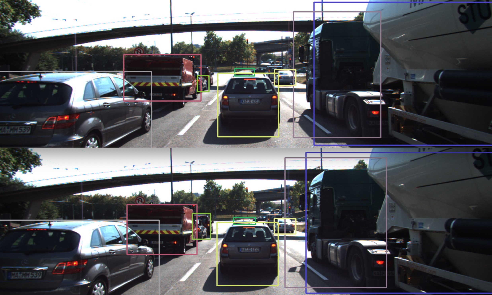
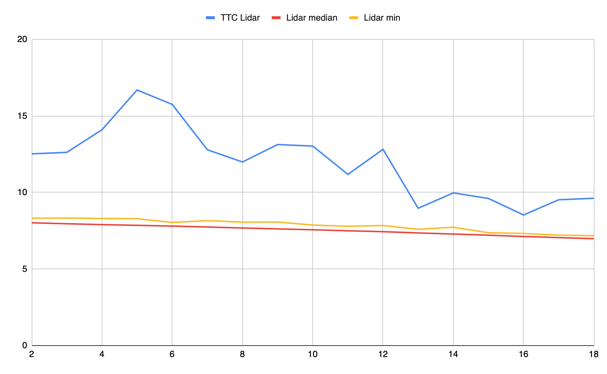
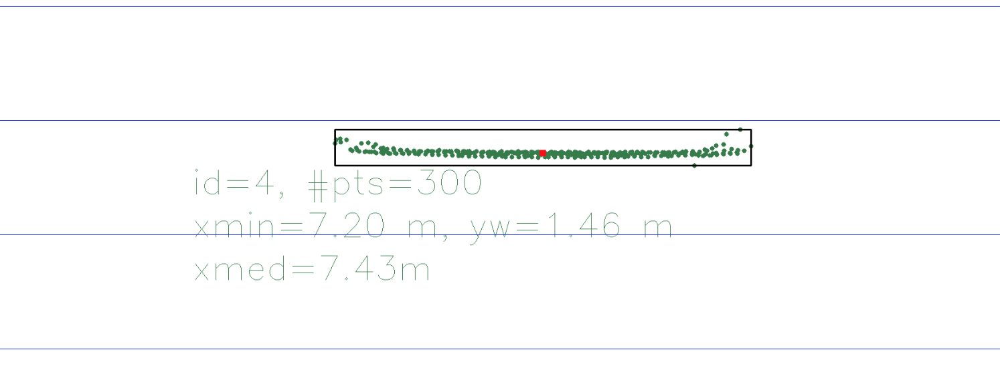
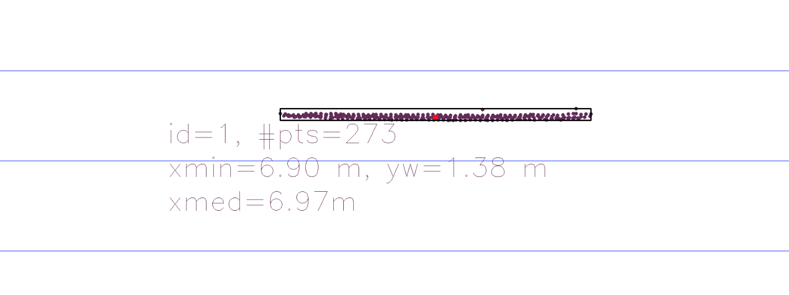
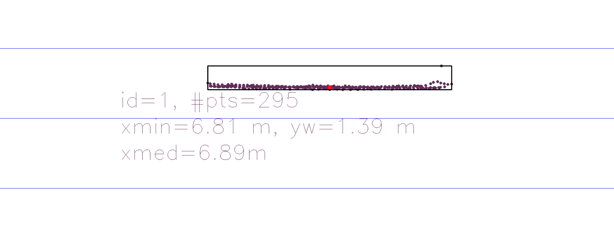
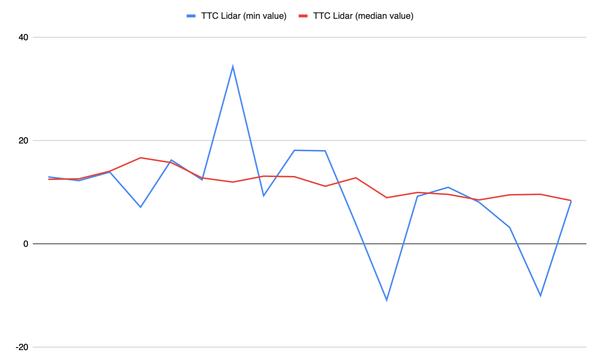
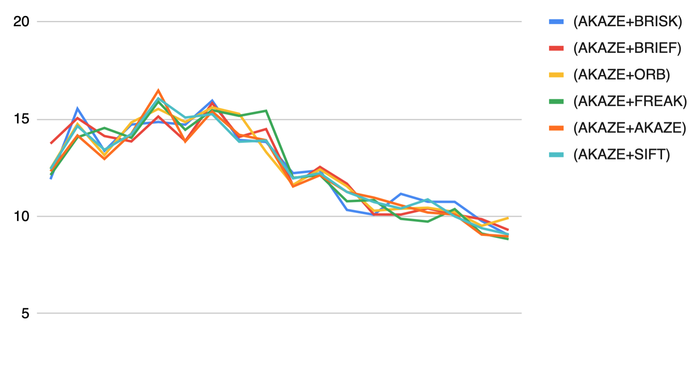

# SFND 3D Object Tracking

# Results
## FP.1 Match 3D Objects

### Description:
Code in [camFusion_Student.cpp](src/camFusion_Student.cpp), matchBoundingBoxes().

My implementation uses a std::map/std::multimap to find bounding boxes in the current and the previous frame with the most common keypoint matches.
It iterates over all found matches and fills datastructures that map bboxes with keypoints in the current frames and keypoints with bounding boxes in the previous frame. 
Then, it iterates over all bounding boxes, counts the number of matches and finds the one with the highest number of matches is found. 
Additionally, it considers bounding box matches only if a minimum number of matches is contained within the two boxes.

For debugging and visualization purposes, I also implemented some lines in [FinalProject_Camera.cpp](src/FinalProject_Camera.cpp) to display the matches returned by matchBoundingBoxes() (lines 224-249). 
Matched bounding boxes are displayed with the same color in the current and the previous image. 

### Exemplary result:

## FP.2 Compute Lidar-based TTC

### Description:
Code in [camFusion_Student.cpp](src/camFusion_Student.cpp), computeTTCLidar() in lines 207-241.

The implementation is pretty much the implementation from the course example, 
relying on the median of the measurement values to filter outliers from the Lidar data. 
I implemented a helper function to calculate the median of a vector.

During the implementation, I experimented with other approaches to filter the data using mean and standard deviation, but the evaluation showed that the median is pretty reliable to filter the outliers as can be seen from the chart below.

For visualization, I also adapted show3DObjects() in [camFusion_Student.cpp](src/camFusion_Student.cpp) to also display the calculated median x-value (red square).

### Exemplary result:
The following chart shows the Lidar minimum x-value, the median and the calculated TTC over all frames

The following graphs show the Lidar data and the median for some exemplary frames.

## FP.3 Associate Keypoint Correspondences with Bounding Boxes

### Description:
Code in [camFusion_Student.cpp](src/camFusion_Student.cpp), clusterKptMatchesWithROI().

The basic functionality of this method is to check if a keypoint lies within the ROI of the bounding box using teh OpenCV contains() method.

Additionally, I tried two different methods to remove outliers from the list of keypoints based on the Euclidian distance of the keypoint pair.
One approach is to calculate the mean and the standard deviation of the distances and use this info to remove outliers. 
The second approach just does not consider the matches with the most extreme Euclidian distances.

I also extended the code to in [FinalProject_Camera.cpp](src/FinalProject_Camera.cpp) (line 308) to display the associated keypoints resulting from this method.

### Results:
The results are summarized in [this Google Sheet (Sheet FP.3 Keypoints Filtering)](https://docs.google.com/spreadsheets/d/1iSDbzwTZ1VBIf5Ap-SAJIPZIDtnj7n7ah9tfM7CzZfk/edit?usp=sharing). 
Extreme outliers that are far off are removed successfully, but the effect on the subsequent calculation of the TTC is relatively small, 
since this method uses the median to remove outliers on its own.

## FP.4 Compute Camera-based TTC

### Description:
Code in [camFusion_Student.cpp](src/camFusion_Student.cpp), computeTTCCamera().

The code is adapted from the course work and uses the median on the distance ratios to filter statistical outliers.

## FP.5 Performance Evaluation 1
   
The median in the calculation of the TTC using Lidar data seems to be a pretty effective measure against outliers. 

Single outlier in x:

Outliers close to the border and higher noise in the measurement:

Nevertheless, by looking at the results, the TTC calculated for some frames look suspicious (frame 3, 15, 16, 17).
One reason might be the increased noise, leading to a "spread" in the data. 
With the "differentation" in the calculation of the TTC, the noise is amplified.

Out of curiosity, I plotted the resulting TTC if the minimum x-value is used instead of the median. 
As expected, the result is pretty bad due to the outliers in the data.

More data is collected in [this Google Sheet (Sheet FP.5 TTC Lidar)](https://docs.google.com/spreadsheets/d/1iSDbzwTZ1VBIf5Ap-SAJIPZIDtnj7n7ah9tfM7CzZfk/edit?usp=sharing)

## FP.6 Performance Evaluation 2
All results were collected with keypoint filter enabled (based on standard deviation).

The measured TTC values for all detector/descriptor combinations are collected in [this Google Sheet (Sheet FP.6 TTC Camera)](https://docs.google.com/spreadsheets/d/1iSDbzwTZ1VBIf5Ap-SAJIPZIDtnj7n7ah9tfM7CzZfk/edit?usp=sharing).

Some main observations:
- The selection of the detector is extremely important for the quality of the TTC calculation.
- Compared to the detector, the selection of the descriptor has a smaller influence.
- The observations from the midterm project are confirmed: FAST+BRIEF is a valid selection.
- FAST detector seems to deliver the best results (due to the fact that the keypoints are well distributed)
- Harris detector completely fails due to the few keypoints found on the car itself.

Two exemplary result charts:

# Original Introduction
Welcome to the final project of the camera course. By completing all the lessons, you now have a solid understanding of keypoint detectors, descriptors, and methods to match them between successive images. Also, you know how to detect objects in an image using the YOLO deep-learning framework. And finally, you know how to associate regions in a camera image with Lidar points in 3D space. Let's take a look at our program schematic to see what we already have accomplished and what's still missing.

In this final project, you will implement the missing parts in the schematic. To do this, you will complete four major tasks: 
1. First, you will develop a way to match 3D objects over time by using keypoint correspondences. 
2. Second, you will compute the TTC based on Lidar measurements. 
3. You will then proceed to do the same using the camera, which requires to first associate keypoint matches to regions of interest and then to compute the TTC based on those matches. 
4. And lastly, you will conduct various tests with the framework. Your goal is to identify the most suitable detector/descriptor combination for TTC estimation and also to search for problems that can lead to faulty measurements by the camera or Lidar sensor. In the last course of this Nanodegree, you will learn about the Kalman filter, which is a great way to combine the two independent TTC measurements into an improved version which is much more reliable than a single sensor alone can be. But before we think about such things, let us focus on your final project in the camera course. 

## Dependencies for Running Locally
* cmake >= 2.8
  * All OSes: [click here for installation instructions](https://cmake.org/install/)
* make >= 4.1 (Linux, Mac), 3.81 (Windows)
  * Linux: make is installed by default on most Linux distros
  * Mac: [install Xcode command line tools to get make](https://developer.apple.com/xcode/features/)
  * Windows: [Click here for installation instructions](http://gnuwin32.sourceforge.net/packages/make.htm)
* Git LFS
  * Weight files are handled using [LFS](https://git-lfs.github.com/)
* OpenCV >= 4.1
  * This must be compiled from source using the `-D OPENCV_ENABLE_NONFREE=ON` cmake flag for testing the SIFT and SURF detectors.
  * The OpenCV 4.1.0 source code can be found [here](https://github.com/opencv/opencv/tree/4.1.0)
* gcc/g++ >= 5.4
  * Linux: gcc / g++ is installed by default on most Linux distros
  * Mac: same deal as make - [install Xcode command line tools](https://developer.apple.com/xcode/features/)
  * Windows: recommend using [MinGW](http://www.mingw.org/)

## Basic Build Instructions

1. Clone this repo.
2. Make a build directory in the top level project directory: `mkdir build && cd build`
3. Compile: `cmake .. && make`
4. Run it: `./3D_object_tracking`.

